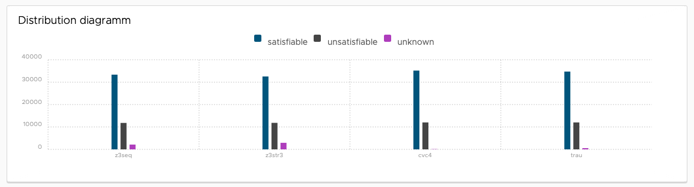
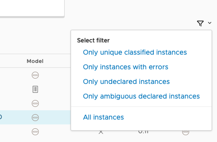

= ZaligVinder:
A string solving benchmark framework
:toc: left
:stem:

_The_ increased interest in string solving in the recent years has made
it very hard to identify the right tool to address a particular user's purpose. Firstly, there is a multitude of string solving, each addressing essentially some subset of the general problem. Generally, the addressed fragments are relevant and well motivated, but 
the lack of comparisons between the existing tools on an equal set of benchmarks cannot go unnoticed, especially as a common framework to compare solvers seems to be missing. In this paper we gather a set of relevant benchmarks and introduce our new benchmarking framework ZaligVinder to address this purpose. 

== Setting up ZaligVinder
All steps to setup this benchmark framework are discribed in the coresponding paper. 

== A short guide for the ZaligVinder WebApp
On the upper end of our web app you can choose between three categories which are explained briefly.

=== Getting Started
This is the current page. It shows you nothing more than this small guide.

=== Benchmark Summary
This pages displays a summary for all of your benchmark sets and tracks.

The sub navigation on the right hand side allows you to choose a specific track or the summary for a whole set of benchmarks. You may have to scroll down to view other tracks.

[.text-center]
image::img/subnav.png[Sub navigation]

Each page offers the user an overview table of grouped instances. The table holds the tool name, how many instances are declared as satisfiable resp. unsatisfiable, unknown instances (the solver terminates without a result before getting killed by the timeout limit), misclassification of an instance (error - currently done by a majority vote between all results of the solvers), timed out instances, the total amount within a track/set of benchmarks, and the overall solving time. 

[.text-center]
image::img/overview.png[Overview table]

The second table shows a ranking of each solver participating on a track. The grading is easily modifiable and currently is done as follows:

* Instance declared correctly: +(`#solver` / `#pos`) Points, meaning the fastest correctly classifying solver gets most of the points.
* Unknown declared instance before timeout kills the solver: +1 Point.
* Timeout: -1 Point.
* Error: -`#solver` Points.

where `#solver` is the amount of solvers being part of a benchmark set and `#pos` the position of the solver within all solvers who classified an instance correctly.

[.text-center]
image::img/ranks.png[Ranking table]

The first diagram shows a distribution for each solver distinguishing between satisfiable/unsatisfiable and timed out resp. unknown instances. 

[.text-center]

The next set of diagrams show the same distribution as before as a pie diagram. This makes an easier identification possible in some cases. 

[.text-center]
image::img/pie.png[Pie diagram]

A cactus diagram follows. In these kind of plots all instances are sorted by their solving time and listed ascending as a point within a line diagram. 
The first cactus plot lists all instances of a track / benchmark set. It gives an intuition of how quick a solver classifies all instances over time. The structure of a cactus plot automatically holds all timed out instances in the end. 

[.text-center]
image::img/cactus_unk.png[Cactus plot with unknowns and errors]

Excluding the unknowns an errors gives an intuition of how quick a solver comes up with the correct answers. By clicking on a label of the graph, the user is able to active/deactivate a specific solver.

[.text-center]
image::img/cactus.png[Cactus plot w/o unknowns and errors]

=== Tool Comparison
This page offers you the opportunity to compare different solvers per instances; finding out what instances caused a good or a bad behaviour. 

The navigation between different tracks and benchmark summaries is again done using the side navigation as explained previously. 

The top box allows you to choose between the available solvers by clicking on a label. Solvers highlighted in green are part of the current comparison. You can disable them by simply clicking the x. White labelled solvers are not part of the comparison. Active them again by a click. 

[.text-center]
image::img/label.png[Tool selection]

The comparison table holds the following elements:

. The instance name - corresponding to the input file. Click on the file icon to view the instance.
. For each solver (listed in the first row of the table):
	* A Result classified by an icon.  means the solver classified the instance as satisfiable, unsatisfiable and  as unknown or timed out.
	* Time to solve the instance
	* The model. If a model is available click on the icon . The absense of a model is indicated by . Whenever a solver terminated unexpectedly we indicate this behaviour by . Click on the icon to view the solvers output.

[.text-center]
image::img/table.png[Table header]

The filter icon on the right hand side gives you the following options:

[.text-center]

[start=3]
. Show unique classfied instances, that is if there is only on solver within the current view which classified the instance. The corresponding solver is marked by  resp. .

[.text-center]
image::img/uniquely.png[Uniquely classified instances]

[start=4]
. Show instances with errors, where only wrongly classified instances given the technique are displayed. The column of the wrong solver is marked again with  resp. 

[.text-center]
image::img/error.png[Errornous classified instances]

[start=5]
. Show undeclared instances lists all instances where no solver found a solution.

[.text-center]
image::img/undeclared.png[Undeclared instances]

[start=6]
. Show only instances, where the solver terminated unexpectedly.
. Only ambiguous answers is showing only instances where an error classification was not possible. This could for instance happen if we do not know the correct answer of an instance and the solvers are not agreeing.

== Availability
=== Binary
We distribute the source of ZaligVinder https://git.zs.informatik.uni-kiel.de/dbp/wordbenchmarks[here].

=== A comparison on the collection of benchmarks
Within the paper we gather sets of benchmarks from literature. They are a available https://git.zs.informatik.uni-kiel.de/dbp/wordbenchmarks/tree/comparison_start/models[here].

In the following we give a small summary overview, of how four of the major string solvers, http://cvc4.cs.stanford.edu/web/[CVC4], https://github.com/Z3Prover/z3[Z3str], https://github.com/Z3Prover/z3[Z3Seq] and
https://github.com/guluchen/z3/tree/new_trau[Trau], and our tool https://www.informatik.uni-kiel.de/~mku/woorpjeLevi/[Woorpje] (on it's restricted set of features) survived.

[TIP] THIS RESULTS NEED AN UPDATE

=== PyEx
|===
|Tool name |Declared satisfiable |Declared unsatisfiable |Declared unknown |Error |Timeout |Total instances |Total time
|z3seq|6486|1371|557|0|557|8414|26275.25
|z3str3|1130|1742|5542|379|5069|8414|174034.78
|cvc4|6293|1357|764|0|764|8414|32406.10
|trau|7018|1384|12|0|12|8414|5367.94
|===

=== Pisa
|===
|Tool name |Declared satisfiable |Declared unsatisfiable |Declared unknown |Error |Timeout |Total instances |Total time
|z3seq|8|4|0|0|0|12|0.54
|z3str3|7|4|1|0|1|12|30.66
|cvc4|8|4|0|0|0|12|2.09
|trau|8|4|0|0|0|12|0.65
|===

=== Norn Benchmarks
|===
|Tool name |Declared satisfiable |Declared unsatisfiable |Declared unknown |Error |Timeout |Total instances |Total time
|z3seq|554|104|369|0|329|1027|13273.75
|z3str3|217|89|721|2|659|1027|21675.82
|cvc4|656|186|185|0|185|1027|5672.32
|trau|214|180|633|74|0|1027|18961.08
|===

=== Trau Light
|===
|Tool name |Declared satisfiable |Declared unsatisfiable |Declared unknown |Error |Timeout |Total instances |Total time
|z3seq|4|94|2|0|2|100|64.75
|z3str3|4|93|3|0|1|100|34.10
|cvc4|3|94|3|0|3|100|93.32
|trau|5|94|1|0|1|100|43.21
|===

=== Leetcode Strings
|===
|Tool name |Declared satisfiable |Declared unsatisfiable |Declared unknown |Error |Timeout |Total instances |Total time
|z3seq|881|1785|0|0|0|2666|103.03
|z3str3|653|1790|223|5|69|2666|2286.40
|cvc4|876|1785|5|0|0|2666|369.35
|trau|881|1785|0|0|0|2666|311.01
|===

=== IBM Appscan
|===
|Tool name |Declared satisfiable |Declared unsatisfiable |Declared unknown |Error |Timeout |Total instances |Total time
|z3seq|7|0|1|0|1|8|31.71
|z3str3|3|0|5|0|4|8|150.14
|cvc4|7|0|1|0|1|8|43.59
|trau|8|0|0|0|0|8|2.71
|===

=== Sloth Tests
|===
|Tool name |Declared satisfiable |Declared unsatisfiable |Declared unknown |Error |Timeout |Total instances |Total time
|z3seq|11|12|17|0|2|40|511.00
|z3str3|9|10|21|0|9|40|630.73
|cvc4|20|16|4|0|1|40|120.98
|trau|11|13|16|2|0|40|480.86
|===

=== Woorpje Word Equations
|===
|Tool name |Declared satisfiable |Declared unsatisfiable |Declared unknown |Error |Timeout |Total instances |Total time
|z3seq|540|165|104|1|104|809|3562.93
|z3str3|448|176|185|8|163|809|5448.31
|cvc4|539|163|107|0|107|809|3408.46
|trau|562|209|38|21|38|809|1955.21
|===

=== Kaluza
|===
|Tool name |Declared satisfiable |Declared unsatisfiable |Declared unknown |Error |Timeout |Total instances |Total time
|z3seq|33438|11799|2047|0|2047|47284|66692.93
|z3str3|32560|11832|2892|33|2642|47284|85798.61
|cvc4|35162|12014|108|0|35|47284|19974.40
|trau|34858|12014|412|0|412|47284|27324.97
|===

=== kaluze_woorpje
|===
|Tool name |Declared satisfiable |Declared unsatisfiable |Declared unknown |Error |Timeout |Total instances |Total time
|z3seq|14793|0|0|0|0|14793|638.29
|z3str3|14793|0|0|0|0|14793|634.91
|cvc4|14793|0|0|0|0|14793|392.18
|trau|14793|0|0|0|0|14793|649.12
|===

=== StringFuzz Tests
|===
|Tool name |Declared satisfiable |Declared unsatisfiable |Declared unknown |Error |Timeout |Total instances |Total time
|z3seq|405|208|452|0|452|1065|14575.44
|z3str3|592|224|249|0|244|1065|7969.61
|cvc4|626|259|180|0|180|1065|5902.22
|trau|511|329|225|12|224|1065|7444.92
|===

=== z3Str3 Regression Test
|===
|Tool name |Declared satisfiable |Declared unsatisfiable |Declared unknown |Error |Timeout |Total instances |Total time
|z3seq|197|45|1|0|0|243|42.20
|z3str3|196|45|2|0|1|243|42.22
|cvc4|183|44|16|0|2|243|487.77
|trau|179|42|22|0|0|243|669.91
|===

=== Cashew Suite
|===
|Tool name |Declared satisfiable |Declared unsatisfiable |Declared unknown |Error |Timeout |Total instances |Total time
|z3seq|377|12|5|0|5|394|207.06
|z3str3|360|12|22|0|22|394|674.93
|cvc4|366|12|16|0|16|394|527.35
|trau|376|12|6|0|6|394|224.86
|===

=== JOACO Suite
|===
|Tool name |Declared satisfiable |Declared unsatisfiable |Declared unknown |Error |Timeout |Total instances |Total time
|z3seq|17|20|57|0|0|94|271.92
|z3str3|17|20|57|0|0|94|6.30
|cvc4|57|21|16|0|16|94|483.38
|trau|16|21|57|1|0|94|1741.88
|===

=== Stranger Benchmarks
|===
|Tool name |Declared satisfiable |Declared unsatisfiable |Declared unknown |Error |Timeout |Total instances |Total time
|z3seq|4|0|0|0|0|4|33.07
|z3str3|4|0|0|0|0|4|0.55
|cvc4|0|0|4|0|4|4|120.00
|trau|3|1|0|1|0|4|5.41
|===

=== Kausler Suite
|===
|Tool name |Declared satisfiable |Declared unsatisfiable |Declared unknown |Error |Timeout |Total instances |Total time
|z3seq|119|0|1|0|1|120|90.44
|z3str3|115|0|5|0|4|120|165.48
|cvc4|120|0|0|0|0|120|41.79
|trau|120|0|0|0|0|120|9.25
|===

== People involved
- https://www.zs.informatik.uni-kiel.de/de/mitarbeiter/mitja-kulczynski[Mitja Kulczynski]
- http://flmanea.blogspot.com/[Florin Manea]
- https://www.zs.informatik.uni-kiel.de/de/mitarbeiter/nowotka[Dirk Nowotka]
- https://www.boegstedpoulsen.dk[Danny Bøgsted Poulsem]

